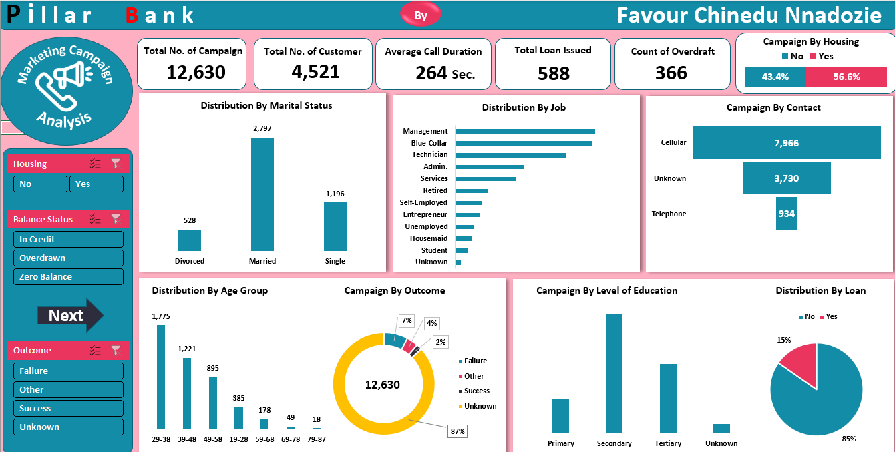

<!--Section 1: Introduce your self-->
## ABOUT ME

Hello! I'm Favour Chinedu Nnadozie 🤓, passionate Data Analyst skilled in Excel, Power BI, SQL, and Tableau, transforming complex datasets and creating interactive dashboards to uncover actionable insights. 
With experience across sales, finance, and customer service, I help businesses solve challenges and unlock growth.

<!--Mention your top/relevant skills here - core and soft skills-->
## WHAT I DO

**Data Analyst (intern)**
At Vital Global Links Autos Limited, i provide the following services for the company:

**-✅Data cleaning and transformation.**

**-✅Analyzing datasets to provide insights that will improve and drive business decisions.**

<!--Section 2: List 3-4 key projects-->
## MY PROJECTS 

*A glimpse of some of the projects I've been working on.*

**Carried out Marketing Campaign Via Phone Call Analysis.
Background.**

<a href="A Portuguese Bank Cleaned Data.xlsx">Download the Report here (pdf file)</a>
A Portuguese Bank Cleaned Data.xlsx

<a href="Pillar Bank Project Documentation.pdf">Download the Report here (pdf file)</a>
